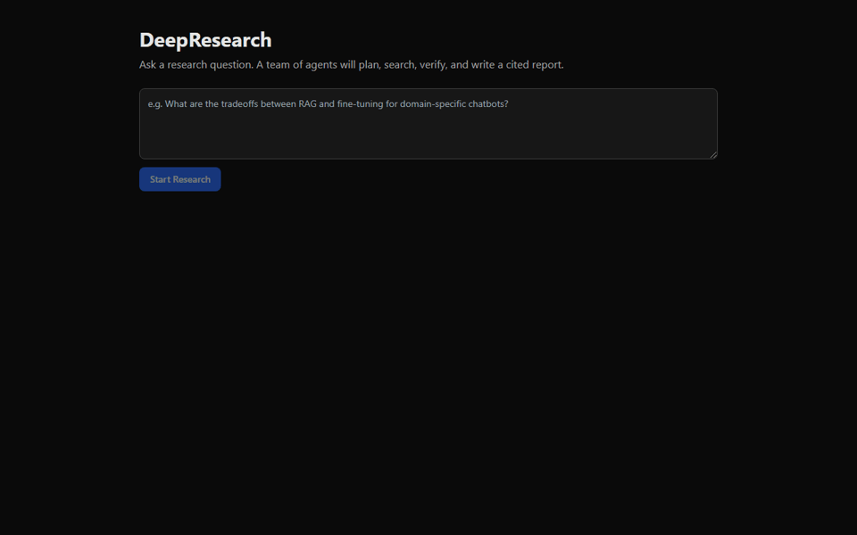
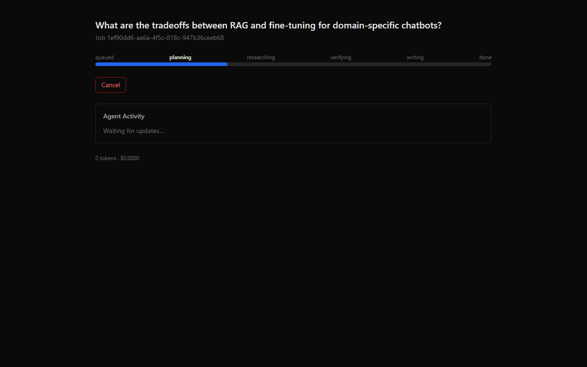
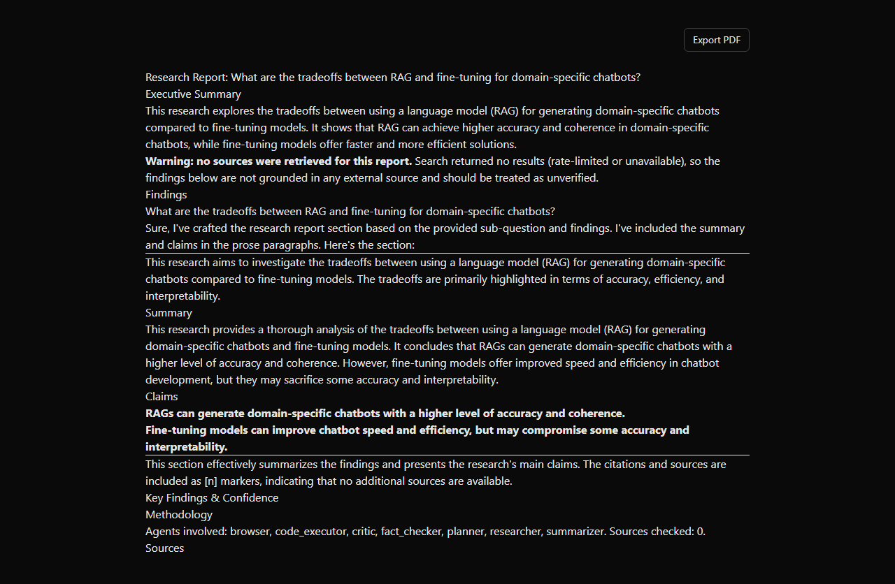
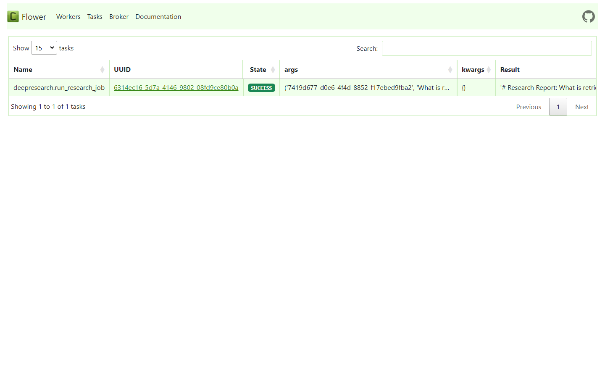
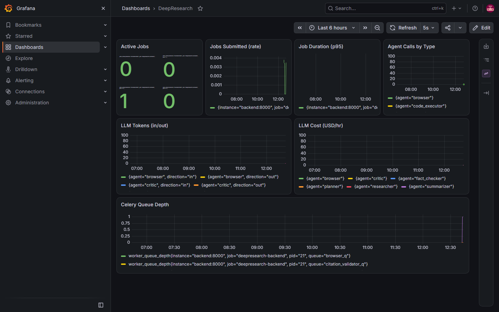
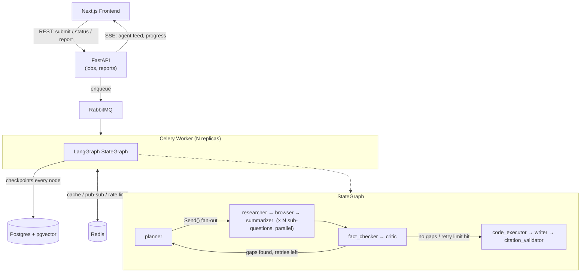

# DeepResearch


Give it a research question; nine cooperating agents plan sub-questions,
search the web in parallel, cross-check every claim against ≥2 sources, and
hand back a cited markdown/PDF report with a per-claim confidence score —
running end to end on your own machine for $0, no paid API required.

## Demo



| Submit a query | Live agent feed | Cited report |
|---|---|---|
|  |  |  |

| Celery tasks (Flower) | Metrics (Grafana) |
|---|---|
|  |  |

## Architecture



## Agents

| Agent | Role |
|---|---|
| Planner | Splits the query into 3-8 sub-questions |
| Researcher | Web search per sub-question (DuckDuckGo / Tavily / SerpAPI) |
| Browser | Full-page fetch via headless Chromium for JS-rendered content |
| Summarizer | Condenses sources into a summary + extracted claims |
| Fact Checker | Cross-references each claim against ≥2 sources, assigns confidence |
| Critic | Flags coverage gaps; can loop research back (bounded by `MAX_RETRY_DEPTH`) |
| Code Executor | Optionally runs sandboxed Python for charts/analysis |
| Writer | Assembles the final cited markdown report |
| Citation Validator | Checks every cited URL is actually reachable |

## Quickstart

```bash
cp .env.example .env
cd infra
docker compose up -d
docker compose exec ollama ollama pull llama3.1
docker compose exec ollama ollama pull nomic-embed-text
```

Open `http://localhost:3000`, submit a query, watch the agent feed, get a
report. API docs at `http://localhost:8000/docs`. Flower (Celery monitoring)
at `http://localhost:5555`. Grafana at `http://localhost:3001` (admin/admin).

First run downloads the Ollama models (a few GB) — subsequent runs are fast.

## Why I built it this way

**LangGraph's `Send()` API over manually fanning out asyncio tasks.**
Sub-question research needs to happen in parallel but still resume cleanly
if a worker dies mid-job. Hand-rolling that with `asyncio.gather` means also
hand-rolling checkpointing; `Send()` gets parallel fan-out *and* per-node
Postgres checkpointing (`PostgresSaver`) for free, so a worker crash resumes
the job on another replica instead of losing it.

**Celery + RabbitMQ instead of driving the graph straight off FastAPI
background tasks.** A single research job can run for minutes and make
dozens of LLM calls; running it in-process would tie up the API server and
make horizontal scaling impossible. Each agent type gets its own queue
(`backend/workers/queues.py`) so, if the workload justified it later, one
agent (e.g. Browser, which is I/O-heavy) could scale independently — today
the graph still runs end-to-end inside one Celery task per job, since
splitting agent-by-agent would mean re-deriving LangGraph's own
checkpoint/resume logic at the queue level for no real benefit yet.

**Free/local by default, not "free tier of a paid API."** Ollama for LLM +
embeddings and DuckDuckGo for search mean the whole system runs for $0 on a
laptop. Every provider is swapped via `.env` and LiteLLM — paid providers
(OpenAI, Anthropic, Tavily) are opt-in, not required to evaluate the project.
The tradeoff is real: DuckDuckGo's unauthenticated search rate-limits fast,
so the Writer agent explicitly renders a "no sources retrieved" warning
banner rather than silently shipping an ungrounded report as if it were
verified — degrading visibly beats degrading silently.

**SSE over WebSockets for the live agent feed.** The feed is one-directional
(server → browser); a full WebSocket round trip buys nothing here that
`EventSource` + Redis pub/sub doesn't already give more simply. The one real
gotcha: `EventSource` can't set custom headers, so `/jobs/{id}/events`
authenticates via a query param instead of the `x-api-key` header the rest
of the API uses (`backend/api/routes/auth.py`) — easy to miss, and it's
exactly the kind of bug that only shows up once you actually load the page
in a browser instead of only curling the API.

**Docker socket mount for the Code Executor sandbox, not `subprocess`.**
Sandboxed Python execution runs as `docker run --network none --memory 512m`
against the host daemon (`backend/tools/code_sandbox.py`), so a crashed or
hostile script can't touch the worker process or the network. gVisor
(`--runtime=runsc`) is a config flag away for stronger isolation in
production; the default runtime is enough for a self-hosted single-user
deployment.

## Security considerations

This is a self-hosted, single-user system by design, not a multi-tenant SaaS
— read the tradeoffs below with that in mind before deploying it anywhere
but your own machine.

- **Every port binds to `127.0.0.1`, not `0.0.0.0`** (`infra/docker-compose.yml`).
  Postgres, Redis, RabbitMQ, Flower, Prometheus, and Grafana are only
  reachable from the host itself. This is the actual primary control —
  several of these services have no auth of their own (Flower) or ship with
  default/weak credentials (Postgres, RabbitMQ, Grafana), and loopback-only
  binding means none of that matters unless someone has a shell on the
  machine already. Deploying on a shared host or exposing any of this
  beyond localhost needs a reverse proxy with real auth in front — don't
  just widen these port bindings back to `0.0.0.0`.
- **Default credentials are overridable, not hardcoded.** `POSTGRES_PASSWORD`,
  `RABBITMQ_USER`/`PASSWORD`, `GRAFANA_ADMIN_PASSWORD`, and Flower's
  `FLOWER_BASIC_AUTH` all read from `.env` with a fallback default for the
  zero-config quickstart — set them in `.env` before deploying anywhere
  reachable by anyone else. The REST API's `API_KEY`
  (`backend/core/config.py`) has no code-level default at all: a
  deployment that forgets to set it fails to start rather than silently
  running on a credential anyone can read in this public repo.
- **The worker's `/var/run/docker.sock` mount is a container-escape vector,
  not just a sandboxing detail.** Code Executor needs it to launch sibling
  sandbox containers (`docker run --network none`, above), but a process
  with access to the host Docker socket can trivially launch a *privileged*
  container and mount the host filesystem — it's effectively root on the
  host, regardless of how locked-down the sandboxed containers themselves
  are. This repo does not mitigate that beyond the network isolation
  already covered; a real production deployment should put a scoped proxy
  (e.g. `tecnativa/docker-socket-proxy`, allowlisting only
  `create`/`start`/`wait`/`remove`) between the worker and the socket
  instead of mounting it directly. Flagged here rather than fixed because
  it changes the sandbox's network topology and deserves its own testing
  pass, not a same-session bolt-on.
- **Agent failures degrade visibly, not silently.** If any agent crashes
  mid-run, the graph doesn't halt (`backend/agents/base.py` catches and
  continues so one flaky agent can't take down the whole job) — but the
  final report now carries a visible warning when that happens
  (`backend/agents/writer.py`), and the error message reaching the DB, the
  SSE feed, and the report itself is a generic one; the actual exception
  (which can embed prompt/query content or a provider error echoing request
  details) only ever goes to server-side logs.

## Scaling workers

Each agent has its own Celery queue defined in `backend/workers/queues.py`,
though the current task graph runs one job end-to-end per Celery task
(LangGraph's own `Send()` API handles the parallel fan-out across
sub-questions within that task, async and in-process). To scale:

```bash
docker compose up -d --scale worker=6
```

or in Kubernetes, `infra/k8s/hpa.yaml` autoscales `deepresearch-worker` on
CPU (2–20 replicas). Because the graph checkpoints to Postgres after every
node, a worker crash resumes the job on another replica rather than losing
the run.

## Cost estimate (typical job)

With the default local stack (Ollama + DuckDuckGo), a research job costs
**$0** — only your own compute. Rough token volume for a 5-sub-question job:
~15-25 LLM calls (planner, 5×summarizer, 5×fact-check, critic, 5×writer
sections, exec summary), ~20-40K tokens total. If you opt into a paid
provider (e.g. `gpt-4o-mini` + Tavily), that's roughly $0.02-$0.05/job in
LLM cost plus Tavily's per-search pricing.

## Example output

See `## Sources` / `## Key Findings & Confidence` sections rendered by
`backend/agents/writer.py` — every claim is tagged HIGH/MEDIUM/LOW/UNVERIFIED,
every citation is numbered and linked, and unreachable citations get flagged
by the Citation Validator rather than silently kept.

## Tests

```bash
cd backend
pip install -r requirements.txt
pytest tests/unit                        # no external deps needed
pytest tests/integration -m integration  # needs docker compose up -d
```

The integration suite is flaky on Windows specifically: pytest-asyncio gives
each test function its own event loop, but `get_db()`/`get_redis()` cache
their async clients process-wide (`@lru_cache`), so a client created in one
test's loop can outlive it and break in the next. Doesn't affect the
Docker-hosted stack (Linux containers, one event loop for the app's whole
lifetime) — only host-side `pytest` runs on Windows.

## Known limitations

- **Search quality depends on your provider.** The default (DuckDuckGo, no
  API key) rate-limits aggressively; expect low-citation-count reports until
  you set `TAVILY_API_KEY` or `SERPAPI_API_KEY` in `.env`.
- **Local model prose quality.** `llama3.1:8b` / `qwen2.5:0.5b` via Ollama
  occasionally write informally even with prompt constraints — a capability
  ceiling of small local models, not a code bug. Swap `LLM_MODEL` for a
  paid provider if you need consistently polished prose.
- **k8s manifests** (`infra/k8s/`) are structurally complete but only the
  Docker Compose path has been exercised against a live stack so far.
